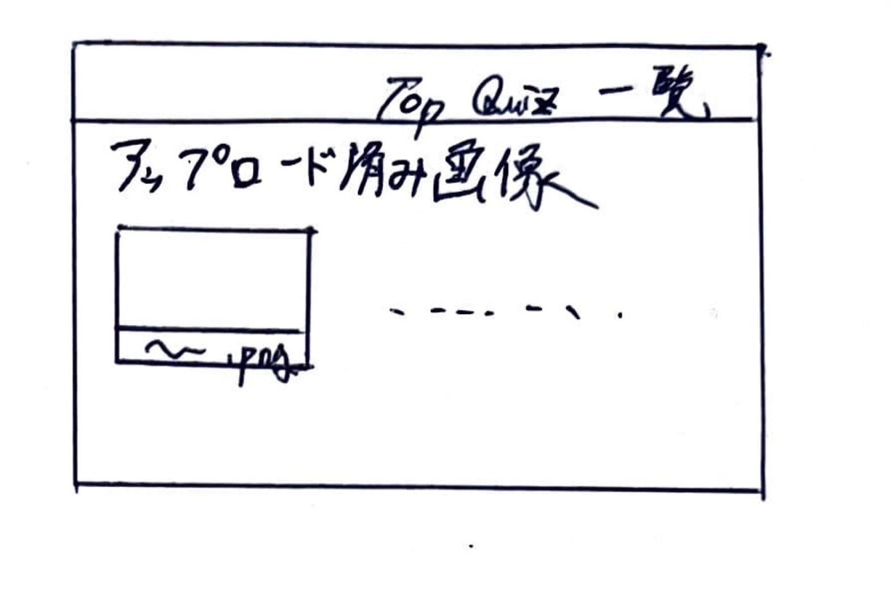

# オブジェクト指向プログラミングおよび演習 第１２回進捗レポート

## 作成者情報

- 学籍番号：k22059
- 氏名：榊原 竜一
- グループ：5
  - メンバー
    - K22059 榊原竜一（チームリーダー）
    - K22041 都築愛弥
    - K22078 高野晴光
    - K22231 伊澤捷
    - K22016 今井翔大
    - K22140 山口瑛士
    - K22072 杉山颯汰
    - K22080 田川裕都
## 仕様

- flaskを使った画像処理クイズアプリ
- 画像をアップロードできる
- アップロードした画像の一覧が見れる
- アップロードした画像の中から好きな画像を選択してその画像でクイズを行う
- 正誤画面で単語の解説が見れる
- CSSで画面を見やすくする
- アップロードした画像を消去
- 他の機能も随時追加

## アプリ完成イメージ

- トップページ
 

- 画像一覧ページ
 

- クイズのレベルと画像の選択ができるページ(レベルの選択と画像の選択のページを分けるかも)
 

- クイズの選択肢の解説ページ
 

## 作業分担

- pull requestの認証　全体のサポート（担当：K22059 榊原 竜一）
- 画像をアップロードできる、ボタンと画像を一致させる判定の作成、アップロード画像消去部分の作成（担当：K22041 都築愛弥）
- アップロード画像の保存、チェックボックスの作成と選択画像の保存、アップロード画像消去部分の装飾（担当：K22016 今井翔大）
- 解説ページの作成(学習できるように単語の意味をつける)（担当：K22078 高野晴光、K22140 山口瑛士）
- 写真基礎単語問題の作成（担当：K22231 伊澤捷）
- 画像処理関数の作成(色抜き問題)（担当：K22072 杉山颯汰）
- 画像処理関数の作成(色の加工)（担当：K22080 田川裕都）

## 作業報告

- 画像処理を動かす関数のプルリクエストを認証
- 細かい質問に対応した（特に画像処理の関数）
- 解説ページの作成に協力した。どうやって書いたら良いかを

## グループ内でお世話になった人2〜3名を理由とともに挙げる

- 授業の中でマージするときに困っていた時助けてくれた（K22231 伊澤捷）
- クイズを作成する中で変更（改良）するべき点を提案してくれた（K22041 都築愛弥）

## 振り返り（感想含む）と次回までの作業予定

私の指示が少なく作業が遅れてしまった。一人一人により詳しく細かい指示をしなくてはいけないと思った。完成までは個人で作成してるものをマージするだけであるが次回の授業内で間に合うか不安である。
